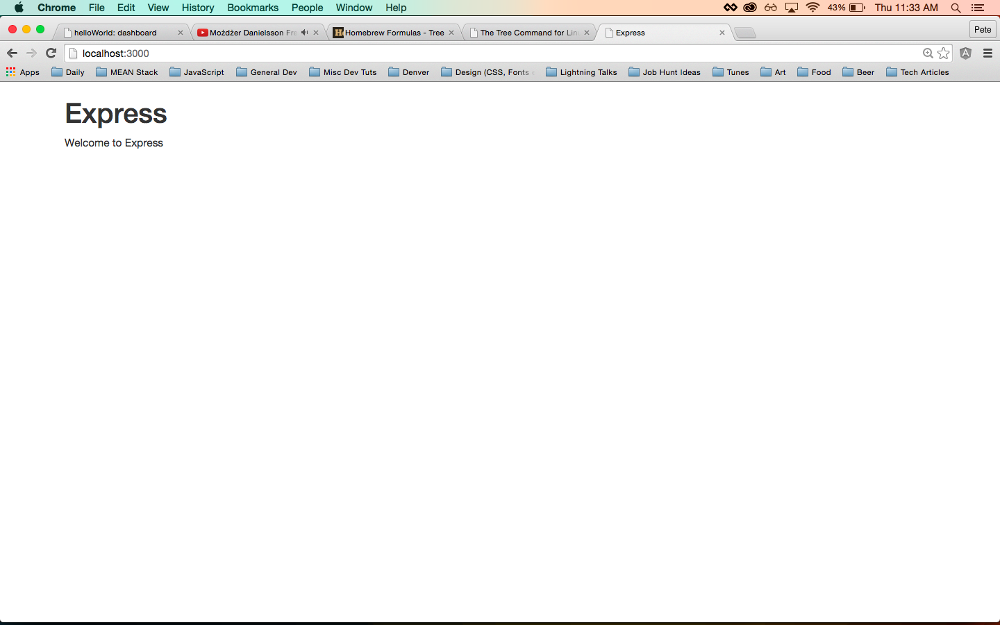
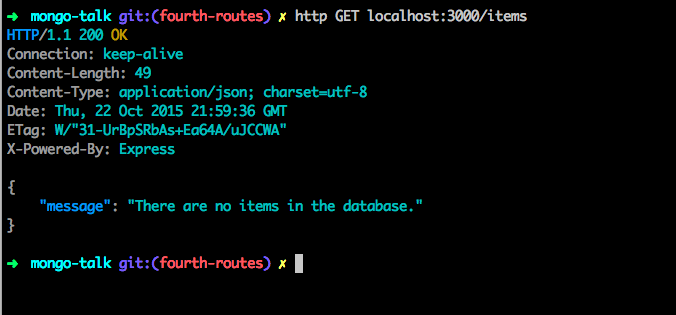
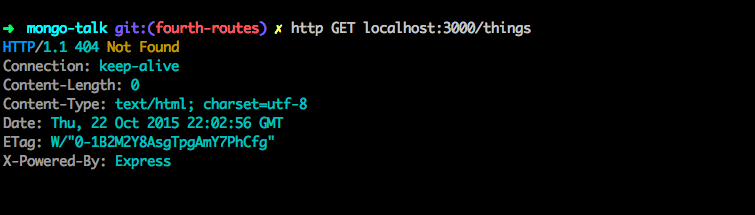
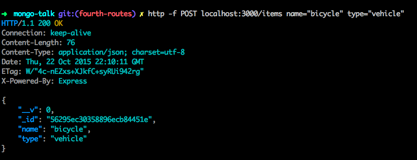
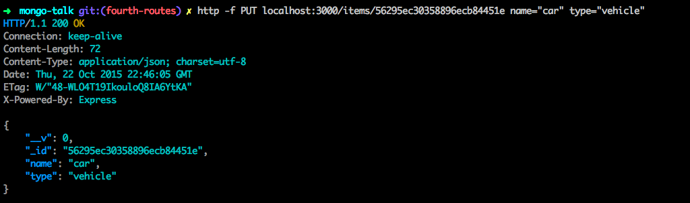
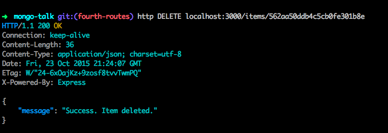

# MongoDB Crud App Tutorial

**This tutorial tackles a vital programming fundamental, _CRUD_**.

Nearly every single application on the web today creates and manipulates data as a core part of its functionality. My goal with this lesson is to get a beginner developer with a basic understanding of the command line, HTML, CSS, JavaScript and an interest in the MEAN stack to take a massive step towards professional coding. This is not going to address all aspects of server-side code, but it will shed some light project setup, routes and MongoDB.   

#### NodeJS

Install [NodeJS](https://nodejs.org/en/).

This will also install [NPM](https://docs.npmjs.com/getting-started/what-is-npm), which is a vital brick in your new path as a MEAN stack developer.

Some key words related to this topic that you may want to look up:
* package.json
* dependencies


#### Express Generator

We continue by installing the Express Generator via NPM. This will provide the basic project structure for our app. If this is your first web app, these files might be a little daunting. **Thats fine. 'Slowly but surely' should be your motto.** We will tackle some of the basics and leave some others for another time. 

```sh
$ npm install -g express generator
```

Let's also install another dependency, [httpie](https://github.com/jkbrzt/httpie), which we'll use later:

```sh
$ brew install httpie
```

> If you don't have Homebrew installed, go [here](http://brew.sh/). Homebrew, much like NPM, is a service that makes downloading and installing packages, or small programs, via the command line a breeze. 

## Part 1 - Initial Project Structure 

>branch: first-generator

Anytime you start a new project, create a new directory to hold all of the files related to that project.

Make a new directory and CD into it:

```sh
$ mkdir mongo-crud && cd mongo-crud
```

Then run the express generator:

```sh
$ npm express-generator
```

The project structure we just created looks like this:

```sh
├── app.js
├── bin
│   └── www
├── package.json
├── public
│   ├── images
│   ├── javascripts
│   └── stylesheets
│       └── style.css
├── routes
│   ├── index.js
│   └── users.js
└── views
    ├── error.jade
    ├── index.jade
    └── layout.jade
```

Get familiar with this layout as it is super common in web application development.

### Refactor with Swig

> branch: second-swig

A 'templating language' provides a syntax for making more dynamic HTML pages. [Jade](http://jade-lang.com/) is a very common 'templating language' used with the MEAN stack. I prefer using [swig](http://paularmstrong.github.io/swig/) instead, a personal choice. Let's convert this app from 'jade' to 'swig':

Add this to your *package.json* file:

```
'swig': '^1.4.2'
```


/mongo-talk/public/images/packagejson-swig.png

Run `npm install` to to install a 'package'. NPM knows to look for the *package.json* file, which was created for us in the express generator build. 

In *app.js* remove:

``` javascript
app.set('views', path.join(__dirname, 'views'));
app.set('view engine', 'jade');
```

And replace with:

```javascript
var swig = require('swig')

var swig = new swig.Swig();
app.engine('html', swig.renderFile);
app.set('view engine', 'html');
```

This is the first look at the *app.js* file, the heart of our application. In here we set the basic behavior and make available the necessities needed to run the app. 

In the **views** folder remove the all files and add: *layout.html* and *index.html*

Cut and paste this code into the layout.html:

``` html
<!DOCTYPE html>
<html>
  <head>
    <meta charset="utf-8">
    <title>{{ title }}</title>
    <link rel="stylesheet" href="//netdna.bootstrapcdn.com/bootstrap/3.3.5/css/bootstrap.min.css">
    <link rel="stylesheet" href="/css/main.css">
  </head>
  <body>
    
    
    <script type="text/javascript" src="//code.jquery.com/jquery-2.1.4.min.js"></script>
    <script src="https://maxcdn.bootstrapcdn.com/bootstrap/3.3.5/js/bootstrap.min.js"></script>
    <script type="text/javascript" src="/js/main.js"></script>
  </body>
</html>
```

This the foundation of all of our HTML pages and we can include content from other HTML files using the 'swig' syntax.

Next, cut and paste this into *index.html*:

```html







  <div class="container">

    <h1>{{ title }}</h1>
    <p>Welcome to {{ title }}</p>

  </div>


```

Look at the ``. That is saying, "This code will be wrapped in the *layout.html* file". Don't be too concerned now with this, as our focus here is the server-side code of this CRUD app. Onward!

In the terminal, in the root of the project directory (`mongo-crud`), run: 

```sh
$ npm start
```

If everything is set up correctly you should see:



Those were all modifications dealing with how our page renders html files. We are now going to setup our app's database, MongoDB along with the Mongoose framework.

## Part 2 - MongoDB Set up

### Set Up MongoDB with Mongoose

> branch: third-mongodb

Start by installing Mongo and Mongoose:

```sh
$ npm install mongodb -g
```

This installed MongoDB on your whole machine so you can use it with all your MEAN projects - no need to run this command again.

```sh
$ npm install mongoose --save
```

This installed mongoose 'locally' - meaning only for this project. This concept of global and local is important. Have a look at the *package.json* file. We now have mongoose in our dependencies. If it is in your *package.json* file, then it is installed specifically for this project - and it's local. 

Keep thinking about local and global as you create more projects, it will become more clear the more you code. For now, just know that NPM installs packages for use both on your computer (global) and/or within specific projects (local).

Let's look at the MongoDB through our terminal.

In the command line, in a new window, type `sudo mongod`, then  enter your admin/computer password. This will start the MongoDB daemon. Now open another new window and type `mongo`. This is the command line interface (or REPL) for MongoDB. Enter the command `show dbs` to show any databases that you have created. If you are using mongo for the first time there will be nothing listed, which will change soon!

Next add a new file, *database.js* to the root directory add the following code:

```javascript
// bring in mongoose and grab the Schema constructor
var mongoose = require('mongoose');
var Schema = mongoose.Schema;


// create new Schema, setting keys and value types
var itemSchema = new Schema ({
	name: String,
	type: String
});

// create a model, which holds all of our Items
var Item = mongoose.model('items', itemSchema);

// set up the connection to the local database, if it doesn't exist yet one will be created automatically
mongoose.connect('mongodb://localhost/mongo-item');

// make the Item Schema available to other files
module.exports = Item;
```

This set up our database and added a structure in which to store our data - a.k.a., the **'Schema'**. We created a place for all the data to be gathered, the **'model'**, and established a **'connection'** to the database.

### Defining a Schema

We have set both of our fields up to accept strings. If we try to put in a number or an object or an array, it will reject it. In *most* cases, it is valuable to specify the type of data going into the database for consistency and security. For example, if you make a query to your DB for items and their quantities you will probably expect quantity value to be an integer. This way you can do math on the quantity of chairs.

```javascript
item = {
    name: 'chair',
    quantity: 8
}

item.quantity += 2
```

But, if you allow your database to take any type for the quantity value when creating items and their quantities, then you may end up with a string instead of a number.  

```javascript
item = {
  name: 'chair',
  quantity: '8'
};

item.quantity += 2;
```

```
console.log(item);

==> {
  name: 'chair',
  quantity: '82'
};
```

So when trying to keep a database clean and tidy so that we can rely on our values, type restriction is a *very* useful technique.

On the other side of the coin, MongoDB allows for different data types to be passed in to the same field, which if used properly, is a very powerful tool. If data is often shifting and fields are being added or taken away, allowing for unspecified values is great. For example if you are keeping track of customers on a site you might have a key with a value that looks like this: 

```javascript
customerInfo: {
    firstName: 'Bob',
    lastName: 'Alvarez',
    city: 'Palisade',
    state: 'Colorado'
}
```

Now what if a customer is a business and not a single person? So 'city' and 'state' are still usable, but 'firstName' and 'lastName' may no longer work. MongoDB is very flexible because of the key value system that it employs. Let's pass in something more appropriate for a business.

```javascript
customerInfo: {
    businessName: 'Denver Pizza Co.'
    city: 'Denver',
    ctate: 'Colorado'
}
```

Or better yet, one account is split between several businesses.

```javascript
cutomerInfo = {
    businessName: ['Bluebird Theater', 'Ogden Theater', 'Dazzle Jazz Club'],
    city: 'Denver',
    ctate: 'Colorado'
}
```

This is a perfectly acceptable solution as far as MongoDB is concerned. With a relational database this would be a very different problem.

Possible schema value types:

* String
* Number
* Date
* Buffer
* Boolean
* Mixed
* Objectid
* Array

We can also pass whole documents (instances of a schema) as a value. As well there is a syntax for referencing other schemas to create relationships. 

More info on Mongoose Schemas [here](http://mongoosejs.com/docs/schematypes.html).

### CRUD Routes

Now into the meat of this tutorial!

What is CRUD?

* Create
* Read
* Update
* Delete

These are the basic operations that an app needs to perform when handling data. You may have heard of a RESTful API, which is similar, but with specific philosophies applied that are out of the scope of this tutorial. For more information on REST go [here](http://www.restapitutorial.com/lessons/whatisrest.html). As a programmer, if you can elegantly handle these actions then you are well on your way to turning your skills into a paycheck. 

Let's begin with our index.js file.

In index.js we need to require our database file to get access to the Schema:

``` javascript
var Item = require('../database.js');
```

The 'out-of-the-box' setup that our express generator provided has 'express' required in our `index.js` and then sets the variable `router` to an instance of an express router object. This object will handle the transferring/serving of data as called for by our HTTP requests. The router object includes functions that we can call on to achieve our basic CRUD operations. When we define these CRUD operations using the router instance, we are creating **routes**. I think of them as pathways for data between our browser/server and the database. I packed a lot of info in there. Don't get bogged down in the exact workings of all of these technologies. The goal here is to expose you to these concepts and to get your hands dirty making them work. As time goes on, they will all slowly make more sense. Focus now on following all the steps and getting this app to work. 

All of our CRUD routes will have a similar structure:

* action: get, post, put, or delete
* path
* function were we define our logic (ie. do stuff with data)
* Mongoose query: find, findOneById, findOneByIdAndUpdate, findOneByIdAndRemove
* response

Go [here](http://mongoosejs.com/docs/queries.html) to checkout the Mongoose docs and the plethora of query functions provided.

So, lets get to it.

#### READ

We need to be able to read or get all of the Items from the database.

```
// call the GET method, and define an anonymous function
router.get('/items', function(req, res, next) {

// query the data base to find all of the Items  
	Item.find({}, function(err, data){

// handle an error
		if (err) {
			res.json(err);
		}
// handle an empty database by checking if the data array is empty
		else if (data.length===0) {
			res.json({message: 'There are no items in the database.'});
		}
// if there are Items, return them	
		else {
			res.json(data);
		}
	});
});
```

There is a TON going on in there and if you are new to routes, it is really intimidating. I broke it down it down somewhat in the comments, but we can dig deeper. 

After we call `router.get`, we define the URL path, in this case `/items`. Our app will use this 'path' to utilize the `GET` functionality of the app.

Inside the function we use the Mongoose `find()` and pass an empty object. This says, 'find all documents in this collection'.

Inside another function we handle the different possibilities: error, no data, or data. The use `res.json()` to return our information. The `res` parameter is short for response and  the `.json` sends the information back the 'JSON' format. More about 'JSON' [here on the MDN site](https://developer.mozilla.org/en-US/docs/Glossary/JSON) and [here for a basic tutorial](https://www.youtube.com/watch?v=BGfmpvM4Zp0).

We are going to test this out with that 'httpie' we installed earlier. 'httpie' is a tool that allows us to test routes in the terminal. We test that our endpoints are being hit, examine what information we get back from different endpoints, as well as mock form submits and pass information. Remember, an 'endpoint' is the same thing as a 'route', it is the place where a path take us.

In the terminal, in you projects root directory fire up the database using `sudo mongod`, and in another tab also in the project's root directory, fire up the server with `npm start`. In yet another tab run:

```

http GET localhost:3000/items

```

You should see this:



You can see in the second line `HTTP/1.1 200 OK`. This means our route was successful and that the logic in our route was executed. That is a huge thing. Congrats! If you don't see this, you have to comb over your code and retrace your steps. Compare you files with mine. You'll find the difference. 

You can confirm that this logic was correct because it returned, "There are no Items in the database." in 'json' format. Come back and test this some more after we create an Item. 


Lets change the route path to illustrate a point. Run:

```

http GET localhost:3000/things

```

You should see this: 



The important clue here is the '404'. We used a 'path' that was undefined, so there was nothing for the browser/server to do. There was no route to handle the browsers/servers request. This is a 404 error. They are common in developing and tell you that you need to investigate your routes or paths.

If you we're to get a '500', this would mean that your route was found, but that some sort of logic within the route was incorrect.

OK, back to the CRUD.

#### CREATE

We need to be able to create information and add or `POST` it to our database. 

```javascript
// call the post method, and define an anonymous function
router.post('/items', function(req, res, next) {

// instantiate a new Item with the values supplied by the request  
	var newItem = new Item({name: req.body.name, type: req.body.type});

// save the new item using a mongoose function
	newItem.save(function(err, data){
// handle an error 
		if (err) {
			res.json(err);
		}
// no error, then return the data in the json format
		else {
			res.json(data);
		}
	});
});

```

The comments sum up what is going on in this route, but there are a few new things in here.

Have a look at the `req.body`. 'req' stands for 'request'. It is an object sent by the browser/server with properties that we can access. We are grabbing the 'body' property and getting its values to instantiate our new Item.

Now we will test this out with httpie in the terminal. Run:

```
http -f POST localhost:3000/items name="bicycle" type="vehicle"

```

The '-f' declares that we are mocking a form submission. Then we pass keys set to values. 

You should see this:




Ok, awesome, we can create new Items. Lets look a little closer at that json object that came back. It has a 'name' and 'type' property which we should expect. But it also has '_id' and '_v'. We won't worry about the latter in this tutorial, but I do want to look at the former.

'_id' is a unique id created by Mongo when a new item is saved. It will always be unique, always. This is important and it is extremely useful. A couple use cases are finding documents in your database, or differentiating between two similar documents.  

We are going to put this `_id` to work in our 'update' route.

#### UPDATE

```
router.put('/items/:id', function(req, res, next) {
	var id = {_id: req.params.id};
	var update = {name: req.body.name, type: req.body.type};
	var options = {new: true};

	Item.findOneAndUpdate(id, update, options, function(err, data){
		if (err) {
			res.json(err.message);
		}
		else {
			res.json(data);
		}
	});
});

```

You should see this:




First off, we called `put` on our router object. This is just another word for update and it is the RESTful syntax for our CRUD app. 

Look at the path that we defined for this route. 

`/items/:id`

The `:id` allows us to pass in a value with the URL and receive it on the other side via the request object. You can see in the logic of the route that we are grabbing that id with `req.params.id`. The variable name you put after the colon is the variable name you will use to access the value within the route. pretty cool. This means we have two ways to pass info to the route: 

1 via the URL, req.params
1 via the body (possibly in a form), req.body

In this route we used both to get our update accomplished. There are many different ways to utilize this functionality and how you implement it will come down to the specific project needs.


#### DELETE

And for our final trick, delete.

```
router.delete('/items/:id', function(req, res, next) {
	Item.findOneAndRemove({_id: req.params.id}, function(err, data){
		if (err) {
			res.json(err.message);
		}
		else if (data.length===0) {
			res.json({message: 'An item with that id does not exist in this database.'});
		}
		else {
			res.json({message: 'Success. Item deleted.'});
		}
	});
});

```

Go through and add your own comments to this route identifying what each part does. If you get stuck, go back and look at the previous routes for clues.

If all goes well you will see this:




This completes the server-side code for our basic crud app. Wow, that was huge. Don't worry if you don't understand it all completely. Sleep on it. And do it again, as much from memory as possible. Maybe next time, depending on the outcome of the request/response send a custom messages back to the user. Change up the Schema to be houses with colors, or cars with years, or friends with phone numbers and birthdays. The CRUD app is essential to you as a programmer, get real familiar with all of its parts. Another great tutorial on NodeJS basics is [Getting Started with Node](http://mherman.org/blog/2014/02/16/getting-started-with-node/#.Vil7IhCrRE4) by my friend Michael Herman. Check it out!

In PART 2 of this tutorial we will sync up the front end so that a user can use the browser to access all of our beautiful CRUD routes to create and manipulate data.

Thanks for reading.
